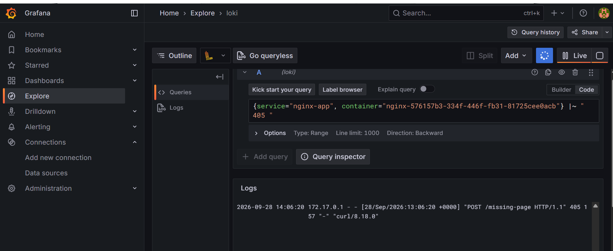

# DevOps Intern Final

[](https://github.com/abihail22558/devops-intern-final/actions/workflows/ci.yml)

A containerized NGINX application demonstrating source control, Linux scripting, containerisation, continuous integration, Nomad orchestration, and centralized log aggregation with Loki.

**Submission Date:** 2026-09-30

## Project Overview

This project implements an end-to-end DevOps workflow for a simple NGINX web application.

The workflow is:

```text
Source Code
    │
    ▼
GitHub Repository
    │
    ▼
GitHub Actions CI
    │
    ├── ShellCheck
    ├── Hadolint
    ├── Docker Build
    └── Application Health Test
    │
    ▼
GitHub Container Registry
    │
    ▼
HashiCorp Nomad
    │
    ├── Docker task
    └── Consul service registration
    │
    ▼
NGINX Application
    │
    ▼
Promtail
    │
    ▼
Loki
    │
    ▼
Grafana Explore
```

Each stage consumes an output from the previous stage: source code is validated by CI, CI builds and publishes the container image, Nomad deploys the published image, and Promtail collects the resulting NGINX logs for Loki and Grafana.

## Application

The application is served by NGINX on port `8080`.

The page displays:

* Developer name
* Assessment date
* Build SHA injected during image creation

The `/healthz` endpoint returns HTTP `200 OK` and is used by Docker, CI, and Nomad/Consul health checks.

## Repository Structure

```text
devops-intern-final/
├── README.md
├── .gitignore
├── app/
│   ├── Dockerfile
│   ├── index.html
│   └── nginx.conf
├── scripts/
│   ├── sysinfo.sh
│   └── healthcheck.sh
├── .github/
│   └── workflows/
│       └── ci.yml
├── nomad/
│   └── nginx-app.nomad.hcl
├── monitoring/
│   ├── loki-config.yaml
│   ├── promtail-config.yaml
│   ├── docker-compose.yaml
│   └── loki_setup.md
└── docs/
    └── screenshots/
        └── task6-grafana-explore.png
```

## Prerequisites

The following tools were used during development and verification:

| Tool             | Version |
| ---------------- | ------- |
| Docker           | 29.8.0  |
| HashiCorp Nomad  | 2.0.7   |
| HashiCorp Consul | 2.0.4   |
| ShellCheck       | 0.9.0   |

The CI workflow also runs ShellCheck and Hadolint automatically.

Docker is required for building and running the application and monitoring containers.

Nomad and Consul are required for the orchestration stage.

## Quick Start

From a clean clone:

```bash
git clone https://github.com/abihail22558/devops-intern-final.git
cd devops-intern-final
docker build -f app/Dockerfile --build-arg BUILD_SHA="$(git rev-parse --short HEAD)" -t devops-intern-final:local .
docker run -d --name devops-intern-final -p 8080:8080 devops-intern-final:local
curl -i http://localhost:8080/
curl -i http://localhost:8080/healthz
bash scripts/healthcheck.sh http://localhost:8080
docker ps
docker rm -f devops-intern-final
```

The expected application and health-check responses are HTTP `200 OK`.

## Task 1 — Source Control

The project uses Git feature branches and incremental commits rather than a single bulk commit.

### Branching Strategy

* `main` — stable project branch
* `feature/*` — isolated development work for individual assessment stages

Each major stage was developed on its own feature branch and merged into `main` through a pull request.

### Commit Convention

Conventional commit prefixes were used:

* `feat:` — new functionality
* `fix:` — bug fixes
* `docs:` — documentation changes
* `ci:` — CI/CD changes
* `chore:` — repository/configuration maintenance

The repository contains multiple incremental commits and merged pull requests covering the assessment stages.

The final release will be tagged:

```text
v1.0.0
```

The tag is created only after final verification is complete.

## Task 2 — Linux Scripting

Two POSIX shell scripts are provided under `scripts/`.

### `scripts/sysinfo.sh`

The script reports:

* Current user
* Effective UID
* Hostname
* Kernel release
* ISO-8601 system date
* Human-readable disk usage
* Memory information
* Docker daemon status

Run:

```bash
sh scripts/sysinfo.sh
```

Example output from the development environment:

```text
System Information
==================
Current user: abiha
Effective UID: 197610
Hostname: Abihail-Forstys-Life
Kernel release: 3.6.9-b4195d69.x86_64
System date: 2026-09-23T11:07:59Z

Disk usage:
Filesystem             Size  Used Avail Use% Mounted on
C:/ Program Files/Git  476G  142G  335G  30% /

Memory usage:
Memory information unavailable: 'free' command not found.

Docker daemon status:
Docker daemon status unavailable: Docker is not installed.
```

The memory and Docker messages reflect the Git Bash/Windows testing environment. The script reports unavailable Linux-specific tools instead of treating the environment difference as a script failure.

### `scripts/healthcheck.sh`

The health-check script accepts a target URL and verifies that the application returns HTTP `200`.

Run:

```bash
bash scripts/healthcheck.sh http://localhost:8080
```

A successful check reports:

```text
Application Health Check
========================
Target URL: http://localhost:8080
SUCCESS: Application returned HTTP 200.
```

A non-200 response produces a clear diagnostic and exits with a non-zero status:

```text
Application Health Check
========================
Target URL: https://example.com/nonexistent-page
ERROR: Application returned HTTP 404; expected HTTP 200.
```

Both scripts use:

```bash
#!/bin/sh
set -euo pipefail
```

and are tracked as executable files.

ShellCheck was used to validate the scripts.

## Task 3 — Containerisation

The application is packaged as a production-shaped NGINX container.

### Base Image

The Dockerfile uses the pinned base image:

```dockerfile
FROM nginx:1.27-alpine-slim
```

The image is not based on `latest`.

### Build

```bash
docker build \
  -f app/Dockerfile \
  --build-arg BUILD_SHA="$(git rev-parse --short HEAD)" \
  -t devops-intern-final:task3 \
  .
```

### Run

```bash
docker run -d \
  --name devops-intern-final \
  -p 8080:8080 \
  devops-intern-final:task3
```

### Image Size

The verified image size was approximately:

```text
19.4 MB
```

This is below the assessment requirement of 60 MB.

### Application Verification

```bash
curl -i http://localhost:8080/
```

Expected response:

```text
HTTP/1.1 200 OK
Server: nginx/1.27.5
X-Build-SHA: <build-sha>
```

The application page exposes the build SHA.

### Health Endpoint

```bash
curl -i http://localhost:8080/healthz
```

Expected response:

```text
HTTP/1.1 200 OK
Content-Type: text/plain
X-Build-SHA: <build-sha>

OK
```

The Docker health check reports the container as healthy.

The NGINX process runs as the non-root `nginx` user.

The custom NGINX configuration listens on port `8080` and provides `/healthz`.

## Task 4 — Continuous Integration

The CI workflow is defined in:

```text
.github/workflows/ci.yml
```

The workflow runs on:

* Pushes to `main`
* Pull requests targeting `main`

### CI Stages

The pipeline contains four stages:

```text
Lint → Build → Test → Publish
```

### Lint

The lint stage runs:

* ShellCheck against `scripts/`
* Hadolint against `app/Dockerfile`

### Build

The image is built with the GitHub commit SHA:

```text
BUILD_SHA=${{ github.sha }}
```

This makes the image build traceable to the source revision.

### Test

The test stage:

1. Builds the application image.
2. Starts the container on port `8080`.
3. Waits for `/healthz`.
4. Runs `scripts/healthcheck.sh`.
5. Displays container status and logs on completion.
6. Removes the test container.

The pipeline fails when the application does not become healthy or the health-check script returns a failure status.

### Publish

Publishing occurs only after successful lint, build, and test stages on pushes to `main`.

The image is published to GitHub Container Registry with two tags:

```text
ghcr.io/abihail22558/devops-intern-final:<github-sha>
ghcr.io/abihail22558/devops-intern-final:latest
```

The SHA tag provides an immutable reference for deployment.

The workflow uses the GitHub-provided `GITHUB_TOKEN` with package write permission only in the publish job.

### CI Badge

The workflow status is shown at the top of this README.

## Task 5 — Nomad Orchestration

The Nomad deployment is defined in:

```text
nomad/nginx-app.nomad.hcl
```

The job uses the Docker driver and deploys one NGINX task.

### Job Configuration

```text
Job type: service
Datacenter: dc1
Task group: nginx
Task count: 1
Driver: docker
CPU: 100 MHz
Memory: 64 MB
```

The container image is parameterized through the HCL variable:

```hcl
variable "image_tag" {
  type    = string
  default = "<immutable-image-sha>"
}
```

The deployment therefore consumes an image published by the CI pipeline rather than building an image directly inside Nomad.

### Networking

Nomad dynamically allocates a named `http` port:

```hcl
network {
  port "http" {
    to = 8080
  }
}
```

The container listens on `8080`.

### Consul Health Check

The application registers with Consul as:

```text
nginx-app
```

The health check is:

```text
HTTP /healthz
Interval: 10s
Timeout: 2s
```

### Deployment Strategy

The job uses:

```text
max_parallel     = 1
min_healthy_time = "10s"
healthy_deadline = "2m"
auto_revert      = true
```

Restart and rescheduling policies are also configured to allow Nomad to recover failed tasks.

### Validation

Validate the job with:

```bash
nomad job validate nomad/nginx-app.nomad.hcl
```

Plan the deployment with:

```bash
nomad job plan nomad/nginx-app.nomad.hcl
```

Run the deployment with:

```bash
nomad job run nomad/nginx-app.nomad.hcl
```

Verify status with:

```bash
nomad job status nginx-app
```

The deployment was verified with one desired allocation and a healthy running task.

Consul registration was also verified through:

```bash
consul catalog services
```

and:

```bash
curl -s "http://127.0.0.1:8500/v1/health/service/nginx-app?passing=true"
```

The `nginx-health` check reported a passing HTTP `200` response from `/healthz`.

## Task 6 — Loki Observability

The monitoring stack is defined in:

```text
monitoring/docker-compose.yaml
```

It contains:

* Grafana Loki `3.7.0`
* Grafana Promtail `3.6.11`
* Grafana `12.1.1`

### Start the Monitoring Stack

```bash
docker compose -f monitoring/docker-compose.yaml up -d
```

Verify the services:

```bash
docker compose -f monitoring/docker-compose.yaml ps
```

### Promtail

Promtail uses Docker service discovery and the Docker socket to identify the Nomad NGINX allocation container.

The collected logs are labelled with:

```text
job
container
service
nomad_alloc_id
```

The NGINX service label is:

```text
service="nginx-app"
```

### NGINX Log Collection

NGINX writes access and error logs to container stdout/stderr so that Promtail can collect them.

During verification, the Nomad allocation used the immutable CI image:

```text
ghcr.io/abihail22558/devops-intern-final:44883a472842de973a8b23d9957a8955d83a57a5
```

The Nomad allocation exposed a dynamically assigned HTTP port.

### Deliberate Log Event

A missing-path test was performed to generate a non-success response.

A GET request returned `200` because the application's NGINX configuration uses SPA fallback behavior.

A POST request to the same missing path produced the required `405` response:

```text
POST /missing-page HTTP/1.1" 405
```

The corresponding NGINX stdout log was:

```text
172.17.0.1 - - [28/Sep/2026:13:06:20 +0000] "POST /missing-page HTTP/1.1" 405 157 "-" "curl/8.18.0"
```

### LogQL Query

The `405` request was isolated in Loki with:

```logql
{service="nginx-app", container="nginx-576157b3-334f-446f-fb31-81725cee0acb"} |~ " 405 "
```

This query returned the expected NGINX access log.

### Grafana

Grafana was configured with Loki as a data source:

```text
http://loki:3100
```

The query was verified in Grafana Explore.

Screenshot:



Additional Loki startup, configuration, labels, queries, troubleshooting, and verification details are documented in:

```text
monitoring/loki_setup.md
```

## Task 7 — Documentation

This README is the primary project documentation and provides:

* Project overview
* Architecture
* Prerequisites
* Quick Start
* Task-by-task implementation details
* Commands used for verification
* Observed results
* CI workflow details
* Nomad deployment instructions
* Loki/Grafana verification
* Troubleshooting history
* Known limitations
* Final verification information

Supporting Loki documentation is maintained in:

```text
monitoring/loki_setup.md
```

Screenshots are stored under:

```text
docs/screenshots/
```

## Troubleshooting

The project required several troubleshooting steps during implementation.

### 1. NGINX Logs Were Not Reaching Loki

**Problem:** NGINX access logs were initially written to files inside the container rather than being exposed through Docker stdout.

**Resolution:** The NGINX configuration was updated to write access and error logs to:

```text
/dev/stdout
/dev/stderr
```

The image was rebuilt, published, and redeployed.

**Result:** Promtail was able to discover the Nomad allocation container and forward the NGINX logs to Loki.

### 2. GET Request to Missing Path Returned HTTP 200

**Problem:** A GET request to a missing path returned `200` instead of a non-200 response.

**Cause:** The application uses SPA fallback behavior:

```nginx
try_files $uri $uri/ /index.html;
```

**Resolution:** A POST request was used against the missing path, producing the expected:

```text
405 Method Not Allowed
```

This response was then successfully isolated in Loki with LogQL.

### 3. Loki Instant Query Rejected the Log Query

**Problem:** An attempt to query Loki through the instant-query endpoint produced:

```text
log queries are not supported as an instant query type
```

**Resolution:** The Loki range-query endpoint was used instead:

```text
/loki/api/v1/query_range
```

**Result:** The expected NGINX log entries were returned.

### 4. Repository Structure Contained Legacy Files

**Problem:** The repository initially contained root-level application files, Kubernetes manifests, and IDE metadata that did not match the required assessment structure.

**Resolution:** A dedicated repository-structure feature branch was used to:

* Move the application page to `app/index.html`
* Remove legacy root Docker configuration
* Remove obsolete Kubernetes manifests
* Remove `.idea/` files from Git tracking
* Add a root `.gitignore`
* Update the Docker build context

The final tracked structure now follows the required assessment layout.

## Known Limitations

The project demonstrates an end-to-end assessment workflow but is not intended to represent a complete production platform.

Known limitations include:

* Nomad and Consul are demonstrated as an assessment environment rather than a highly available multi-node production cluster.
* The monitoring stack uses local Docker volumes rather than production-grade persistent storage.
* Grafana authentication and enterprise access controls are outside the scope of the assessment.
* TLS termination and a production reverse-proxy layer are not implemented.
* The application is intentionally simple and does not include a backend service or database.
* The CI pipeline publishes the `latest` tag for convenience, while Nomad deployment uses an immutable SHA tag for reproducibility.

With additional implementation time, the environment could be extended with highly available Nomad/Consul infrastructure, TLS, persistent observability storage, stronger access controls, and automated infrastructure provisioning.

## Final Verification

Before final submission, verify:

```bash
git status
git log --oneline --decorate -n 10
git tag
```

The final working tree should be clean.

The final release tag is:

```text
v1.0.0
```

The GitHub repository is:

```text
https://github.com/abihail22558/devops-intern-final
```

The final submission should use the public repository and the `v1.0.0` tag.
